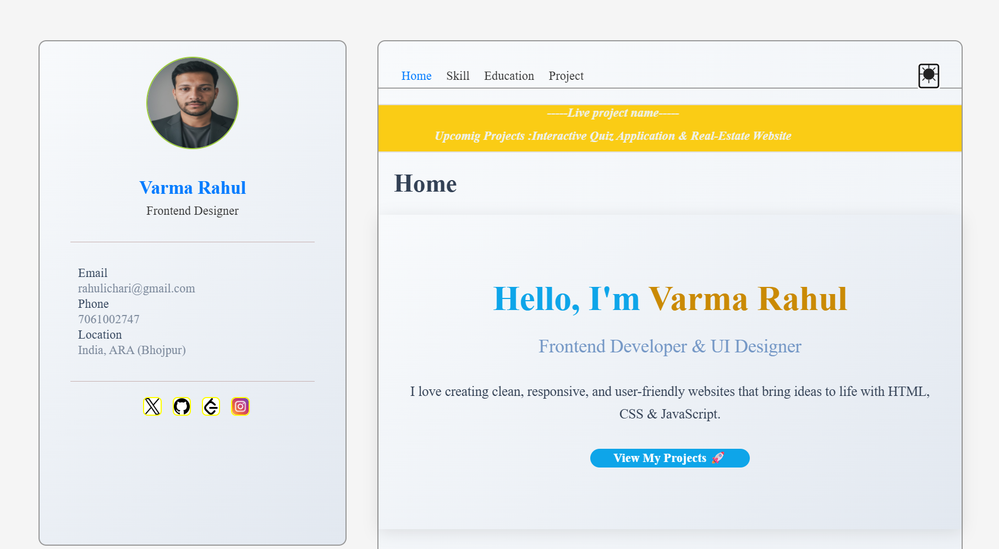

# 🌐 Personal Portfolio Website

Welcome to my **Personal Portfolio Website** — a fully responsive and visually appealing platform that showcases my skills, projects, and achievements as a **Frontend Developer**.  

This portfolio is built with simplicity, elegance, and interactivity in mind. It supports both **Light** and **Dark** themes, allowing visitors to switch between modes for a better browsing experience.

---

## ✨ Features

- 📱 **Fully Responsive Design** — Optimized for all screen sizes (mobile, tablet, and desktop).
- 🌗 **Light & Dark Theme Toggle** — Seamless theme switching with saved user preference.
- 🏃 **Live Project Marquee** — Uses the HTML `<marquee>` attribute to display currently active or ongoing projects dynamically.
- 🎨 **Modern UI/UX** — Clean layout with smooth animations and hover effects.
- ⚡ **Fast Loading** — Lightweight structure and optimized assets for speed.
- 🧩 **Reusable Components** — Well-organized HTML, CSS, and JS for easy updates.

---

## 🛠️ Tech Stack

- **HTML5** — Semantic structure for better accessibility.
- **CSS3** — Flexbox, Grid, and custom variables for theme control.
- **JavaScript (ES6)** — Theme toggling and interactive UI behavior.

---

## 🎯 Sections

1. **Home:** Hero section introducing who I am.  
2. **About:** My skills, tools, and education.  
3. **Projects:** Display of my featured and live projects (scrolling marquee).  
4. **Contact:** Easy ways to reach me via email or social links.

---

## 🚀 Marquee Feature Example

html
<marquee behavior="scroll" direction="left" scrollamount="6">
  🚧 Working on: Real-Estate Website | E-Commerce UI | Quiz app 
</marquee>

## How to Run Locally
const toggleBtn = document.getElementById('theme-toggle');
toggleBtn.addEventListener('click', () => {
  document.body.classList.toggle('dark-mode');
  localStorage.setItem('theme', document.body.classList.contains('dark-mode') ? 'dark' : 'light');
});
## 📸 Preview

🤝 Connect With Me

🌍 Portfolio Websit : https://rahulichari-portfolio-website.netlify.app/

💼 LinkedIn : https://www.linkedin.com/in/rahul-kumar-105068257/

🐙 GitHub : https://github.com/imRvarma

📧 Email: rahulichari@gmail.com.com

## 🖼️ 1️⃣ Screenshot

